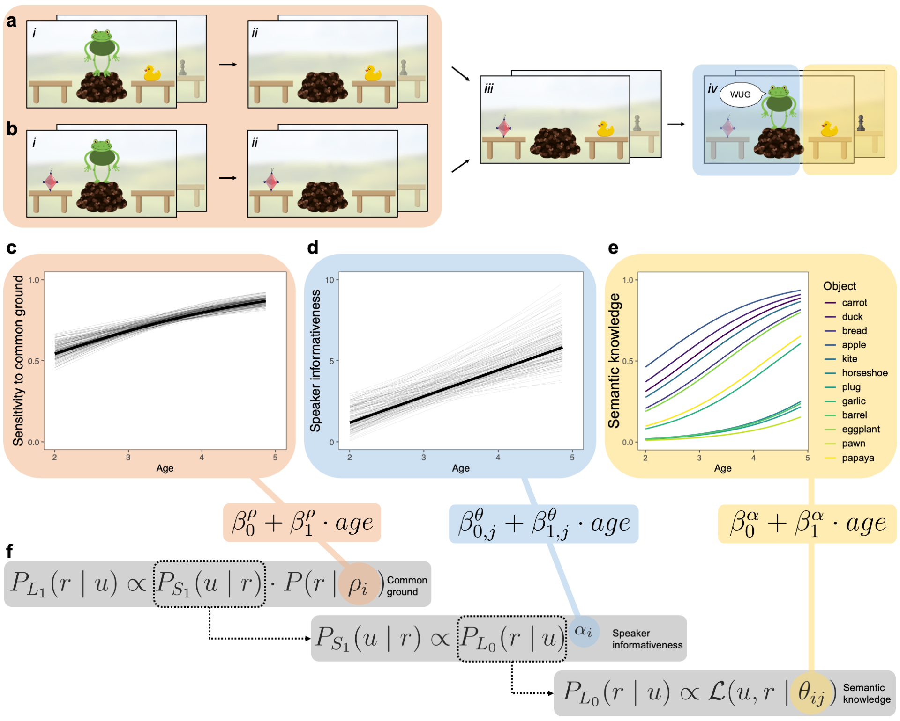
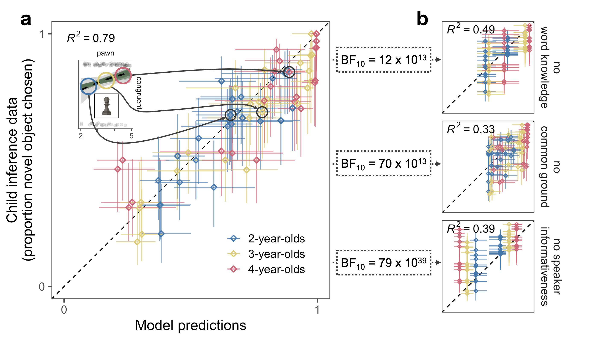
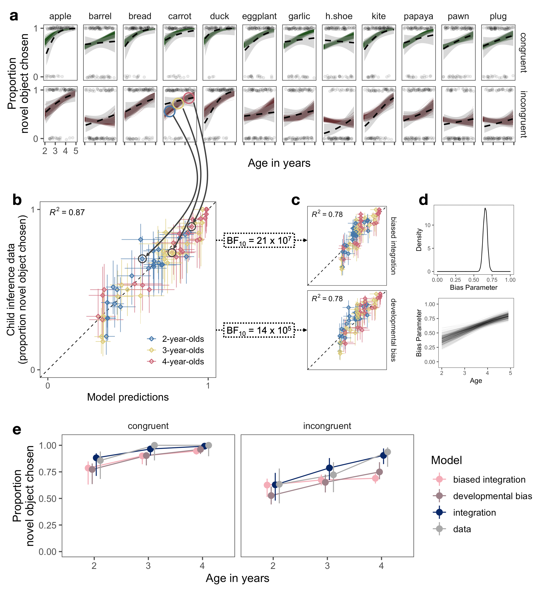

```{r setup, include = FALSE}
library("papaja")
library("tidyverse")
library("coda")

estimate_mode <- function(s) {
  d <- density(s)
  return(d$x[which.max(d$y)])
}


hdi_upper<- function(s){
  m <- HPDinterval(mcmc(s))
  return(m["var1","upper"])
}

hdi_lower<- function(s){
  m <- HPDinterval(mcmc(s))
  return(m["var1","lower"])
}

```

```{r analysis-preferences}
# Seed for random number generation
set.seed(42)
knitr::opts_chunk$set(cache.extra = knitr::rand_seed)
```

Human communicative communicative abilities are unrivaled in the animal kingdom [@taylor2016language; @tomasello2008origins; @fitch2010evolution]. Language - in whatever modality - is the medium that allows humans to collaborate and coordinate in species-unique ways, making it the bedrock of human culture and society [@smith1997major]. Thus, in order to absorb the culture around them and become functioning members of a society, children need to learn language [@tomasello2018natural]. A central problem in language learning is referent identification: to learn the conventional symbolic relation between a word and an object, a child has to determine the intended referent of the word. Referents can only be identified in an inferential manner by reasoning about the speaker’s intentions [@bohn2019pervasive; @bruner1983child; @clark2009first; @tomasello2009constructing]. That is, the child has to infer what the speaker is communicating about based on information sources in the social context of the utterance.

From early on in development, children use a number of different mechanisms to harness such social-contextual information sources [@bohn2019pervasive; @clark2009first; @bloom2002children]. For example, children expect speakers to use novel words for unknown objects [@clark1987principle; @markman1988children; @carey1978acquiring; @halberda2003development], to talk about objects that are relevant [@frank2014inferring; @schulze20133], new in context [@akhtar1996role; @diesendruck2004two], or related to the ongoing conversation [@bohn_le_peloquin_koymen_frank_2020; @sullivan2016discourse; @horowitz2015young]. These different mechanisms, however, have largely been described and theorized about in isolation. The picture of the learning process that emerges is that of a “bag of tricks”: mechanisms that operate (and develop) independently from one another [@bloom2002children]. As such, this view of the learning process does not capture the complexity of natural social interaction during which many sources of information are present [@bergelson2017nature; @frank2013social]. Theses sources need to be integrated in order to accurately infer a speaker's intention. 

When information integration is studied directly, the focus is mostly on how children interpret an ambiguous referring expression in light of social-contextual information [@ganea2007infants; @graham2017words; @grosse201021; @jara2020social; @khu2020preschoolers; @matthews2006effect; @nilsen2009preschoolers]. In one of these studies [@nadig2002evidence], children faced a 2 x 2 display with a ball, a pen and two glasses in it. The speaker, sitting on the opposite side of the display, saw only 3 of the compartments: the ball, the pen, and one of the glasses. When the speaker asked for "the glass", children had to integrate the semantics of the utterance with the perspective of the speaker to correctly infer which of the glasses - from their perspective - the speaker was referring to. This study, along with others, found that preschoolers use both information sources. What these studies do not do, however, is specify the process by which children integrate the different information sources. When discussing their results, authors refer to social-pragmatic theories of language use and learning [@grice1991studies; @sperber2001relevance; @clark1996using; @clark2009first; @tomasello2009constructing], all of which assume that information is integrated as part of a social inference process, but none of which clearly defines the process. As a consequence, we have no explicit and quantitative theory of how different information sources (and word learning mechanisms) are integrated. 

We present a theory of this integration process. Following social-pragmatic theories of language learning [@clark2009first; @tomasello2009constructing], our theory is based on the following premises: information sources serve different functional roles, all part of an integrated social inference process [@clark1996using; @grice1991studies; @shafto2012learning; @sperber2001relevance]. Children use all available information to make inferences about the intentions behind a speaker’s utterance, which then leads them to correctly identify referents in the world and learn conventional word–object mappings. We formalize the computational steps that underlie this inference process in a cognitive model [@frank2012predicting; @goodman2016pragmatic; @oberauer2019addressing]. In the remainder of this paper, we rigorously test this theory by asking how well it serves the two purposes of any psychological theory: prediction and explanation [@shmueli2010explain; @yarkoni2017choosing]. First, we use the model to make quantitative predictions about children's behavior in new situations - predictions we test against new data. Next, we test how well the model explains the integration process by comparing it to alternative models that make different assumptions about *whether* information is integrated, *how* it is integrated and how the integration process *develops*.  

We focus on three information sources that play an integral part in theorizing about language use and learning: (1) expectations that speakers communicate in a cooperative and informative manner [@frank2014inferring; @clark1987principle; @sperber2001relevance], (2) shared common ground about what is being talked about in conversation [@bohn2018common; @clark1996using; @clark2015common], and (3) semantic knowledge about previously learned word–object mappings [@fenson1994variability; @bloom2002children]. These information sources operate on different timescales: while (1) is a momentary expectation about a particular utterance, (2) grows over the course of a conversation, and (3) is learned across development. This interplay of timescales has been hypothesized to be an important component of word meaning inference [@frank2009using; @mcmurray2012word]. 

Our *rational integration model* arbitrates between information sources via Bayesian inference (see Fig. 1f for model formula). A listener ($L_{1}$) reasons about the referent of a speaker's ($S_{1}$) utterance. This reasoning is contextualized by the prior probability of each referent $\rho$ -- which we take to be a function of the common ground shared between the listener and the speaker. To decide between referents, the listener ($L_{1}$) reasons about what a rational speaker ($S_{1}$) with informativeness $\alpha$ would say given an intended referent. This speaker is assumed to compute the informativity for each available utterance and then choose the most informative one. The informativity of each utterance is given by imagining which referent a listener, who interprets words according to their literal semantics (what we call a literal listener, $L_{0}$), would infer upon hearing the utterance. Naturally, this reasoning depends on what kind of semantic knowledge (for object j) $\theta$~j~ the speaker ascribes to the (literal) listener. Taken together, this model provides a quantitative theory of information integration during language learning. Furthermore, the model presents an explicit and substantive theory of development. It assumes that, while children’s sensitivity to the individual information sources increases with age, the way integration proceeds remains constant [@bohn2019pervasive; @bohn_tessler_merrick_frank_2019]. In the model, this is accomplished by making the parameters capturing sensitivity to speaker informativeness ($\alpha$~i~, Fig. 1d), the common ground ($\rho$~i~, Fig. 1c), and object specific semantic knowledge ($\theta$~i,j~, Fig. 1e) a function of the child’s age. 

```{r fig1, include = T, fig.align = "center", fig.cap = "Experimental task and model. (a and b) Screenshots from the experimental task. (i) The speaker encounters one object and then leaves the scene (ii). While the speaker is away, a second object appears (iii), when returning, the speaker uses a novel word to request an object (iv). Sections (i) to (iii) establish common ground between the speaker and the listener, in that one object is new in context (green). The request in (iv) licenses an inference based on expectations about how informative speakers are (red). Listeners' semantic knowledge enters the task because the identity of the  known object on one of the tables is varied from well-known objects like a duck to relatively unfamiliar objects like a chess pawn (total of 12 objects - blue). (a) shows the condition in which common ground information is congruent (i.e. point to the same object) with speaker informativeness and (b) shows the incongruent condition. The congruent and incongruent conditions are each paired with the 12 known objects, resulting in 24 unique conditions. (c to e) show developmental trajectories for each information source, estimated from separate experiments (see supplement). (f) gives the model equation for the rational integration model and links information sources to model parameters.", out.width="100%"}

```

To test the predictive and explanatory power of our model, we developed a world-learning paradigm in which we jointly manipulated the three information sources (Fig. 1). Children interacted on a tablet computer with a series of storybook speakers [@frank2016using]. The speakers used novel words (e.g., "wug") in the context of two potential referents. This situation is depicted in Fig. 1a iv, in which a speaker (here, a frog) appears with a known object (a duck, left) and an unfamiliar object (the diamond-shaped object, right). To identify the referent, the child could rely upon the three information sources described above. First, they may infer that a cooperative speaker would have used the word "duck" to refer to the known object (the duck); the fact that the speaker did not say duck then suggests that the speaker is most likely referring to a different object (the unfamiliar object). This basic inference is oftentimes referred to as a mutual exclusivity inference [@markman1988children; @halberda2003development]. More generally speaking, the listener can infer the referent of the novel word by assuming that the speaker is a rational agent who chooses the most informative words to refer to objects [@clark1987principle; @frank2014inferring]. Second, the child may rely upon what has already been established in the common ground with the speaker. Listeners expect speakers to communicate about things that are new to the common ground [@akhtar1996role; @diesendruck2004two]. Thus, the inference about the novel word referring to the unfamiliar object also depends on which object is new in context (Fig. 1a and b i-iii). Finally, the child may rely upon their previously acquired semantic knowledge, that is, how sure they are that the known object is called "duck". If the known object is something less familiar, such as a chess piece (e.g., a pawn), a 3-year-old child may draw a weaker inference, if they draw any inference at all [@lewis2020-me; @grassmann2015children]. Taken together, the child has the opportunity to integrate their assumptions about (1) cooperative communication, (2) their understanding of the common ground, and (3) their existing semantic knowledge. In some versions of the experiment, some of these information sources were aligned (Fig. 1a) but in some they were in conflict (Fig. 1b). 

# Results

## Predicting information integration across development

We tested the model in its ability to predict children’s actual behavior - at an age (between 2 and 5 years) at which they learn language at an exponential rate [@bloom2002children]. We estimated children’s (N=148) developing sensitivity to individual information sources in separate experiments (Experiment 1 and 2) (see Fig. 1c-e). We then generated parameter-free, quantitative, *a priori* model predictions (developmental trajectories) representing the model's expectations about how children should behave in a new situation in which all three information sources had to be integrated. We generated model predictions for 24 experimental conditions: 12 objects of different familiarities (requiring different levels of semantic knowledge), with novelty either conflicting or coinciding; Fig. 1. We compared these predictions to newly collected data from N = 220 children from the same age range (Experiment 3). 

The results showed a very close alignment between model predictions and the data across the entire age range. That is, the average developmental trajectories predicted by the model resembled the trajectories found in the data (Fig. S6). For a more quantitative analysis, we binned predictions and data by year and correlated them. We found a high correlation, with the model explaining 79% of the variance in the data (Fig. 2a). These results seem to support the assumptions in the model that children integrate all available information sources. However, it is still possible that simpler models might make equally good -- or even better -- predictions.

Thus, we formalized the alternative view that children selectively ignore information sources in the form of three lesioned models (Fig. 2b). These models assume that children follow the heuristic “ignore X” (with X being one of the information sources) when multiple information sources are presented together.

The *no word knowledge model* uses the same model architecture as the rational integration model. It takes in expectations about speaker informativeness and common ground, but omits semantic knowledge that is specific to the familiar objects (i.e., uses only general semantic knowledge). That is, the model assumes a listener whose inference does not vary depending on the particular familiar object but only depends on the age specific average semantic knowledge. The *no common ground model* takes in object specific semantic knowledge and speaker informativeness but ignores common ground information. Instead of assuming that one object has a higher prior probability to be the referent because it is new in context, the speaker thinks that both objects are equally likely to be the referent. As a consequence, the listener does not differentiate between situations in which common ground is aligned or in conflict with the other information sources. Finally, according to the *no speaker informativeness model*, the listener does not assume that the speaker is communicating in an informative way and hence ignores the information provided by the utterance. As a consequence, the inference is solely based on common ground expectations.

We found little support that children make inferences following one of the heuristic models (Fig. 2b). When using Bayesian model comparison via marginal likelihood of the data, [@lee2014bayesian], we find that the data was several orders of magnitude more likely under the rational integration model compared to any of the lesioned models (Fig. 2). Taken together, we may conclude that children considered all available information sources.

(ref:figlab2) **Predicting information integration**. Correlation between model predictions and child inference data for all 24 conditions and for each age group (binned by year) for the rational integration model (a) and the three lesioned models (b). Horizontal and vertical error bars show 95% HDI. Inset shows an example of model predictions as developmental trajectories (see Fig. 3). The no word knowledge model includes developmental change for overall vocabulary development but ignores the identity of the known object. The no common ground model assumes that children ignore information from common ground and the no speaker informativeness model assumes that children ignore inferences that are licensed by expectations about informative communication. BF~10~ gives the Bayes Factor in favor of the integration model based on the marginal likelihood of the data under each model.

```{r fig2, include = T, fig.align = "center", fig.cap = "(ref:figlab2)", out.width="100%"}


```

## Explaining the process of information integration

The fact that children integrated all the available information sources may be surprising, but does not rule out that the integration process itself might be different from the one described in the rational integration model, which assumes that all information sources enter into an integrated inference process. However, a more modular view seems equally plausible: children might compute separate inferences based on a subset of the available information and then integrate them by weighting them according to some ratio. This view would allow for the possibility that some information sources are considered to be more important than others. In other words, children might be biased towards some information sources. We formalized this alternative view as a *biased integration model*. This model assumes that semantic knowledge and expectations about speaker informativeness enter into one inference (mutual exclusivity inference [@markman1988children; @lewis2020-me; @clark1987principle]) while common ground information enters into a second one. The outcome of both processes are then weighted according to the parameter $\phi$. Like the rational integration model, this model takes in all available information sources in an age sensitive way and assumes that they are integrated - the only difference lies in the nature of the integration process. 

The parameter $\phi$ in the biased integration model is unknown ahead of time and has to be estimated based on the experimental data. That is, in contrast to the rational integration model, the biased integration model does not allow to make *a priori* predictions about new data in the way we describe above. For the model comparison, we therefore constrained the parameters in the rational integration model by the data from EXperiment 3 as well. As a consequence, both models use all the information available to constrain their parameters (see Fig. S4).

```{r}
mixture_parameter <- readRDS("../saves/mixture_mm.rds")

phi <- mixture_parameter%>%
  summarise(mode = estimate_mode(p_informative), 
            lci = hdi_lower(p_informative), 
            uci = hdi_upper(p_informative))
```


The biased integration model makes reasonable predictions that explain a large proportion of the variance in the data (Fig. 3b). The parameter $\phi$ - indicating the bias to one of the inferences - was estimated to favor the mutual exclusivity inference (mode = `r phi%>%pull(mode)`; 95% highest density interval (HDI): `r phi%>%pull(lci)` - `r phi%>%pull(uci)`, see Fig. 3d). However, the rational integration model presented a much better fit to the data, both in terms of correlation and marginal likelihood of the data (Fig. 3). Thus, a fully integrated - as opposed to a sequential and biased - integration process explained the data better.

The rational integration model assumes that the integration process itself does not change with age [@bohn2019pervasive]. That is, while children's sensitivity to each information source develops, the way they relate to one another remains the same. An alternative perspective would be to assume that the integration process itself changes with age. The biased integration model provides a way to think about developmental change in the integration process: Children are biased towards some information sources, but the bias itself changes with age. We formalize such an alternative view as a *developmental bias model* which is structurally identical to the biased integration model but in which the parameter $\phi$ changes with age. The model assumes that the importance of the different information sources changes with age.

```{r}
developmental_mixture_parameter <- readRDS("../saves/mixture_dmm.rds")

phi_dev <- developmental_mixture_parameter%>%
  filter(type == "slope")%>%
  summarise(mode = estimate_mode(value), 
            lci = hdi_lower(value), 
            uci = hdi_upper(value))
```

The developmental bias model also explains a substantial portion of the variance in the data (Fig. 3c). The estimated developmental trajectory for the bias parameter $\phi$ suggests that younger children put a higher emphasis on common ground information, while older children rely more on the mutual exclusivity inference (Fig. 3d). The relative importance of the two inferences seems to switch at around age 3. Yet again, when we directly compare the competitor models, we find that the data is several orders of magnitude more likely under the rational integration model (Fig. 3). Interestingly, when we compared the rational integration model with its parameters not constrained by the experimental data (i.e. the "pure" prediction model described above), it also outperformed both bias models (see Fig. S10 and Tab. S6). Taken together, these results show that the integration process is best described as fully integrated and stable over time. 

(ref:figlab3) **Explaining information integration across development**. (a) Model predictions from the rational integration model (colored lines) next to the behavioral data (dotted black lines with 95% CI in gray) for all 24 experimental conditions. Top row (blue) shows conditions in which common ground information is congruent with speaker informativeness, bottom row (red) shows conditions in which they are incongruent. Known objects are ordered based on their rated age of acquisition (left to right). Light dots represent individual data points. (b) Correlations between model predictions binned by age and condition for the integration model and (c) the two mixture models. Vertical and horizontal error bars show 95% HDIs. BF~10~ gives the Bayes Factor in favor of the rational integration model based on the marginal likelihood of the data under each model. (d) Posterior distribution of the bias parameter in the biased integration model and developmental trajectories for the bias parameter in the developmental bias model based on 300 random draws from the posterior distribution of the intercept and slope.

```{r fig3, include = T, fig.align = "center", fig.cap = "(ref:figlab3)", out.width="100%"}

```

# Discussion

The environment in which children learn language is complex. Children have to integrate different information sources, some of which relate to expectations in the moment, others to the dynamics of the unfolding interactions and yet others to their previously acquired knowledge. Our findings show that young children can flexibly integrate multiple information sources during language learning - even from relatively early in development. To answer the question of how they do so, we presented a formal cognitive model that assumes that information sources are rationally integrated via Bayesian inference. 

Our work extends the study of information integration during language comprehension [@tanenhaus1995integration; @kamide2003integration; @hagoort2004integration; @ozyurek2007line; @heller2016perspective] to pragmatics. Our model is based on classic social-pragmatic theories on language use and comprehension [@clark1996using; @grice1991studies; @sperber2001relevance; @tomasello2009constructing]. As a consequence, instead of assuming that different information sources feed into separate word-learning mechanisms, we assume that they all play a functional role in an integrated social inference process. Our model goes beyond previous theoretical and empirical work by specifying the computations that may underlie this inference process. Furthermore, we present a substantive theory about how this integration process develops: We assume that children become increasingly sensitive to different information sources but that the way these information sources are integrated, remains the same. We used this model to predict and explain children's information integration in a new word learning paradigm in which they had to integrate (1) their assumptions about informative communication, (2) their understanding of the common ground, and (3) their existing semantic knowledge. 

We found that this rational integration model made accurate quantitative predictions across a range of experimental conditions - in some of which information sources were aligned, in some of which they were in conflict. Predictions from the model better explained the data compared to lesioned models which assumed that children ignore one of the information sources, suggesting that children used all available information. 

To test the explanatory power of the model - how well it explains the process by which information is integrated - we formalized an alternative, modular, view. According to the biased integration model, children use all available information sources but compute separate inferences based on a subset of them. Integration happens by weighting the outcomes of these separate inferences by some ratio. By allowing the ratio to be in favor of one of the inferences, this model captures the idea that children might be biased to some information sources over others. Even though such a model made reasonable predictions, we found that the rational integration model explained children's behavior much more accurately. Finally, we tested an alternative view on the development of the integration process. According to the developmental bias model, the importance of the different information sources changed with age. Again, the rational integration model provided a much better fit to the data, suggesting that the integration process remains stable over time. 

The rational integration model is derived from a more general framework for pragmatic inference, which has been used to explain a wide variety of phenomena in adults’ language use and comprehension [@monroe2017colors; @wang2016learning; @tessler2019language; @yoon_frank_tessler_goodman_2018;@frank2012predicting; @goodman2016pragmatic]. Thus, it can be generalized in a natural way to capture word learning in contexts that offer more, fewer, or different types of information. For example, in a recent study with adults and children, Bohn and colleagues [@bohn_tessler_merrick_frank_2019] manipulated expectations about informativeness and common ground in a different way. Using a structurally similar model, they also found a close alignment between model predictions and the data. The flexibility of this modeling framework stems from its conceptualization of human communication as a form of rational social action. As such, it connects to computational and empirical work that tries to explain social reasoning by assuming that humans expect each other to behave in a way that maximizes the benefits and minimizes the cost associated with actions [@bridgers2020young; @jara2016naive; @jara2020social].

There are multiple ways in which the model and the experiments presented here could be extended. First, it would be important to replicate our findings in a more diverse sample, that is, with children from a different cultural background who learn a different language [@nielsen2017persistent]. In such a study, we would not expect that our results replicate in a strict sense; that is, we would not expect to see the same developmental trajectories in all cultures and/or languages. Substantial variation is much more likely. Nevertheless, our computational model provides a way to think about how to reconcile cross-cultural variation with a universal cognitive architecture: We expect differences in how sensitive children are to the individual information sources at different ages, but similarities in how information is integrated [@bohn2019pervasive]. In computational terms, we assume a universal architecture that specifies the relation between a set of varying parameters.

Second, it would be useful to flesh out the cognitive processes that underlie reasoning about common ground. In its current form, our model does not specify how the listener arrives at the expectation that some objects are more likely referents because they are new in common ground. We assume that common ground changes speaker's expectations about what are likely referents [@hanna2003effects] and measured these expectations to inform the parameter values in our model. Computationally, the model does not differentiate between common ground information and other reasons that might make an object contextually more salient.

Finally, our model is a model of referent identification in the moment of the utterance. Word learning, however, is a cumulative process which happens across multiple time points and contexts. Thus, it would be fruitful to connect our model with frameworks that focus on the temporal and cross-situational aspects of word learning [@frank2009using; @mcmurray2012word; @yurovsky2015integrative].

Taken together, this work helps us understand how children navigate the complexity of their learning environment. Methodologically, it illustrates how formal, computational models can be used to test theories - bot in terms of their predictive and explanatory power. From a theoretical perspective, it adds to broader frameworks that see the onto- and phylogenetic emergence of language as deeply rooted in social cognition.

# Methods

A more detailed description of the experiments and the models can be found in the supplementary material. The experimental procedure, sample size and analysis for each experiment were pre-registered (https://osf.io/7rg9j/registrations). Experimental procedures, model and analysis scripts can be found in an online repository (https://github.com/manuelbohn/spin). Experiment 1 and 2 were designed to estimate children's developing sensitivity to each information source. Their results inform the parameter values in the model (see Fig. 1 c-f). Experiment 3 was designed to test how children integrate the different information sources.

## Participants

```{r}
me_data <- read_csv("../data/me.csv")
prior_data <- read_csv("../data/novelty.csv")
comb_data <- read_csv("../data/combination.csv")
```

Across the three experiments, a total of `r length(unique(me_data$subid)) + length(unique(prior_data$subid)) + length(unique(comb_data$subid))` children participated. Experiment 1 involved `r length(unique(me_data$subid))` children, including `r length(unique(me_data$subid[me_data$subage == 2]))` 2-year-olds (range = `r format(round(min(me_data$age_num[me_data$subage == 2]),2), nsmall = 2)` - `r format(round(max(me_data$age_num[me_data$subage == 2]),2), nsmall = 2)`, 15 girls), `r length(unique(me_data$subid[me_data$subage == 3]))` 3-year-olds (range = `r format(round(min(me_data$age_num[me_data$subage == 3]),2), nsmall = 2)` - `r format(round(max(me_data$age_num[me_data$subage == 3]),2), nsmall = 2)`, 22 girls) and  `r length(unique(me_data$subid[me_data$subage == 4]))` 4-year-olds (range = `r format(round(min(me_data$age_num[me_data$subage == 4]),2), nsmall = 2)` - `r format(round(max(me_data$age_num[me_data$subage == 4]),2), nsmall = 2)`, 16 girls). Data from 10 additional children was not included because they were either exposed to less than 75% of English at home (5), did not finish at least half of the test trials (2), the technical equipment failed (2) or their parents reported an autism spectrum disorder (1). 

In Experiment 2, we tested `r length(unique(prior_data$subid))` children from the same general population as in Experiment 1, including `r length(unique(prior_data$subid[prior_data$subage == 2]))` 2-year-olds (range = `r format(round(min(prior_data$age_num[prior_data$subage == 2]),2), nsmall = 2)` - `r format(round(max(prior_data$age_num[prior_data$subage == 2]),2), nsmall = 2)`, 7 girls), `r length(unique(prior_data$subid[prior_data$subage == 3]))` 3-year-olds (range = `r format(round(min(prior_data$age_num[prior_data$subage == 3]),2), nsmall = 2)` - `r format(round(max(prior_data$age_num[prior_data$subage == 3]),2), nsmall = 2)`, 14 girls) and  `r length(unique(prior_data$subid[prior_data$subage == 4]))` 4-year-olds (range = `r format(round(min(prior_data$age_num[prior_data$subage == 4]),2), nsmall = 2)` - `r format(round(max(prior_data$age_num[prior_data$subage == 4]),2), nsmall = 2)`, 14 girls). Data from 5 additional children was not included because they were either exposed to less than 75% of English at home (3) or the technical equipment failed (2).

Finally, Experiment 3 involved `r length(unique(comb_data$subid))` children, including `r length(unique(comb_data$subid[comb_data$subage == 2]))` 2-year-olds (range = `r format(round(min(comb_data$age_num[comb_data$subage == 2]),2), nsmall = 2)` - `r format(round(max(comb_data$age_num[comb_data$subage == 2]),2), nsmall = 2)`, 7 girls), `r length(unique(comb_data$subid[comb_data$subage == 3]))` 3-year-olds (range = `r format(round(min(comb_data$age_num[comb_data$subage == 3]),2), nsmall = 2)` - `r format(round(max(comb_data$age_num[comb_data$subage == 3]),2), nsmall = 2)`, 14 girls) and  `r length(unique(comb_data$subid[comb_data$subage == 4]))` 4-year-olds (range = `r format(round(min(comb_data$age_num[comb_data$subage == 4]),2), nsmall = 2)` - `r format(round(max(comb_data$age_num[comb_data$subage == 4]),2), nsmall = 2)`, 14 girls). Data from 20 additional children was not included because they were either exposed to less than 75% of English at home (15), did not finish at least half of the test trials (3) or the technical equipment failed (2). 

All participants were recruited from the floor of a Children’s museum in San José, California, USA. This population is characterized by a diverse ethnic background (predominantly White, Asian, or mixed ethnicity) and high levels of parental education and socioeconomic status. Parents consented to their children’s participation and provided demographic information. All experiments were approved by the Stanford Institutional Review Board (protocol no. 19960).

## Materials

All experiments were presented as an interactive picture book on a tablet computer [@frank2016using]. Fig. 1a and b show screenshots from the actual experiments. The general setup involved an animal standing on a little hill between two tables. For each animal character, we recorded a set of utterances (one native English speaker per animal) that were used to talk to the child and make requests. Each experiment started with two training trials in which the speaker requested known objects (car and ball). 

## Procedure

Experiment 1 tested the so-called mutual exclusivity inference [@markman1988children; @lewis2020-me]. On one table, there was a familiar object, on the other table, there was an unfamiliar object (drawn for the purpose of the study) (Fig. 1a/b iv and Fig. S1a). The speaker requested an object by saying "Oh cool, there is a [non-word] on the table, how neat, can you give me the [non-word]?". Children responded by touching one of the objects. The location of the unfamiliar object (left or right table) and the animal character were counterbalanced. We coded as correct choice if children chose the unfamiliar object as the referent of the novel word. Each child completed 12 trials, each with a different familiar and a different unfamiliar object. Familiar objects were selected to vary along the dimension of how likely children were to know the word for it. This included objects that most 2-year-olds can name (e.g. a duck) as well as objects that only very few 5-year-olds can name (e.g. a pawn). The selection was based on age of acquisition ratings from Kuperman and colleagues [-@kuperman2012age]. While these ratings do not capture the absolute age when children acquire these words, they capture the relative order in which words are learned. Fig. S2A in the supplementary material shows the words and objects used in the experiment.

Experiment 2 tested children's sensitivity to common ground that is built up over the course of a conversation. In particular, we tested whether children keep track of which object is new to a speaker and which they have encountered previously [@akhtar1996role; @diesendruck2004two]. The general setup was the same as in Experiment 1 (Fig. S1b). The speaker was positioned between the tables. There was an unfamiliar object (drawn for the purpose of the study) on one of the tables while the other table was empty. Next, the speaker turned to one of the tables and either commented on the presence ("Aha, look at that.") or the absence ("Hm, nothing there") of an object. Then the speaker disappeared. While the speaker was away, a second unfamiliar object appeared on the previously empty table. Then the speaker returned and requested an object in the same way as in Experiment 1. The positioning of the unfamiliar object in the beginning of the experiment, the speaker as well as the location the speaker turned to first was counterbalanced. Children received five trials, each with a different pair of unfamiliar objects. We coded as correct choice if children chose the object that was new to the speaker as the referent of the novel word.

Experiment 3 combined the procedures from Experiment 1 and 2. It followed the same procedure as Experiment 2 but involved the same objects as Experiment 1 (Fig. 1 i-iv and Fig. S1c). In the beginning, one table was empty while there was an object (unfamiliar or familiar) on the other one. After commenting on the presence or absence of an object on each table, the speaker disappeared and a second object appeared (familiar or unfamiliar). Next, the speaker re-appeared and made the usual request. In the congruent condition, the familiar object was present in the beginning and the unfamiliar object appeared while the speaker was away (Fig. 1a and Fig. S1c - left). In this case, both the mutual exclusivity and the common ground inference pointed to the novel object as the referent. In the incongruent condition, the unfamiliar object was present in the beginning and the familiar object appeared later. In this case, the two inferences pointed to different objects (Fig. 1b and Fig. S1c - right). This resulted in a total of 2 (congruent vs incongurent) x 12 (familiar objects) = 24 different conditions. Participants received up to 12 test trials, six in each alignment condition, each with a different familiar and unfamiliar object. Familiar objects were the same as in Experiment 1. The positioning of the objects on the tables, the speaker and the location the speaker first turned to were counterbalanced. Participants could stop the experiment after six trials (three per alignment condition). If a participant stopped after half of the trials, we tested an additional participant to reach the preregistered number of data points per age group (2-, 3- and 4-year-olds).  

## Data analysis

To analyze how the manipulations in each experiment affected children's behavior, we used generalized linear mixed models. Since the focus of the paper is on how information sources were integrated, we discuss these models in the supplementary material and focus here on the cognitive models instead. A detailed, mathematical description of the different cognitive models along with details about estimation procedures and priors can be found in the supplementary material. All Bayesian cognitive models and Bayesian data analytic models were implemented in the probabilistic programming language `WebPPL` [@dippl]. The corresponding model code can be found in the associated online repository.

As a first step, we used the data from Experiment 1 and 2 to estimate children's developing sensitivity to each information source. To estimate the parameters for semantic knowledge ($\theta$) and speaker informativeness ($\alpha$), we adapted the rational integration model to a situation in which both objects (novel and familiar) have equal prior probability (i.e., no common ground information). We used the data from Experiment 1 to then infer the parameters. That is, we inferred the intercepts and slopes for speaker informativeness (linear regression) and semantic knowledge (logistic regression) that generated model predictions to match the responses generated in Experiment 1. To estimate the parameters representing sensitivity to common ground ($\rho$), we used a simple logistic regression to infer which combination of intercept and slope would generate predictions that corresponded to the average proportion of correct responses measured in Experiment 2. For the explanation models, these parameters were additionally constrained by the data from Experiment 3. A more detailed description of how these parameters were estimated (including a graphical model) can be found in the supplementary material. 

To generate model predictions, we combined the parameters according to the respective model formula. As mentioned above, common ground information could either be aligned or in conflict with the other information sources. In the congruent condition, the unfamiliar object was also new in context and thus had the prior probability $\rho$. In the incongruent condition, the novel object was the "old" object and thus had the prior probability of $1 - \rho$.

The rational integration model is defined as $P^{int}_{L_1}(r \mid u; \{\rho_i, \alpha_i\, \theta_{ij}\})\propto P_{S_1}(u \mid r; \{\alpha_i, \theta_{ij}\}) \cdot P(r \mid \rho_i)$. The three lesioned models that were used to compare how well the model predicts new data are reduced versions of this model. The no word knowledge model uses the same model architecture: $P^{no\_wk}_{L_1}(r \mid u; \{\rho_i, \alpha_i\, \theta_{i}\})\propto P_{S_1}(u \mid r; \{\alpha_i, \theta_{i}\}) \cdot P(r \mid \rho_i)$ and the only difference lies in the parameter $\theta$. The object specific parameters for semantic knowledge are fitted via a hierarchical regression (mixed effects) model. That is, there is an overall developmental trajectory for semantic knowledge (main effect - $\theta_{i}$) and then there is object-specific variation around this trajectory (random effects -- $\theta_{ij}$). Thus, the no word knowledge model takes in the overall trajectory for semantic knowledge ($\theta_{i}$) but ignores object-specific variation. The no common ground model ignores common ground information (represented by $\rho$) and is thus defined as $P^{no\_cg}_{L_1}(r \mid u; \{\alpha_i\, \theta_{ij}\})\propto P_{S_1}(u \mid r; \{\alpha_i, \theta_{ij}\})$. For the no speaker informativeness model, the parameter $\alpha = 0$. As a consequence, the likelihood term in the model is 1 and the model therefore reduces to $P^{no\_si}_{L_1}(r \mid u; \{\rho_i\})\propto P(r \mid \rho_i)$.

As noted above, the explanation models used parameters that were additionally constrained by the data from Experiment 3. This had no effect on the way these parameters were combined in the rational integration model. The biased integration model is defined as $P^{biased}_{L_1}(r \mid u; \{\phi, \rho_i, \alpha_i, \theta_{ij} \}) = \phi \cdot P_{ME}(r \mid u; \{\alpha_i, \theta_{ij}\})  + (1-\phi) \cdot P(r \mid \rho_i)$ with $P_{ME}$ representing a mutual exclusivity inference which takes in speaker informativeness and object specific semantic knowledge. This inference is then weighted by the parameter $\phi$ and added to the respective prior probability, which is weighted by $1-\phi_i$. Thus, $\phi$ represents the bias in favor of the mutual exclusivity inference. In the developmental bias model the parameter $\phi$ is made to change with age ($\phi_i$) and the model is thus defined as $P^{dev\_bias}_{L_1}(r \mid u; \{\phi_i, \rho_i, \alpha_i, \theta_{ij} \}) = \phi_i \cdot P_{ME}(r \mid u; \{\alpha_i, \theta_{ij}\})  + (1-\phi_i)$.

We compared models in two ways. First, we used Pearson correlations between model predictions and the data. For this analysis, we binned the model predictions and the data by age in years and by the type of familiar object (see Fig. 2 and 3 as well as S7 and S10). Second, we compared models based on the marginal likelihood of the data under each model -- the likelihood of the data averaging over ("marginalizing over") the prior distribution on parameters; the pairwise ratio of marginal likelihoods for two models is known as the Bayes Factor. It is interpreted as how many times more likely the data is under one model compared to the other. Bayes Factors quantify the quality of predictions of a model, averaging over the possible values of the parameters of the models (weighted by the prior probabilities of those parameter values); by averaging over the prior distribution on parameters, Bayes Factor implicitly take into account model complexity because models with more parameters will tend to have a broader prior distribution over parameters, which in effect, can water down the potential gains in predictive accuracy that a model with more parameters can achieve [@lee2014bayesian]. For this analysis, we treated age continuously.

\newpage

# References
```{r create_r-references}
r_refs(file = "r-references.bib")
```

\begingroup
\setlength{\parindent}{-0.5in}
\setlength{\leftskip}{0.5in}

<div id = "refs"></div>
\endgroup
