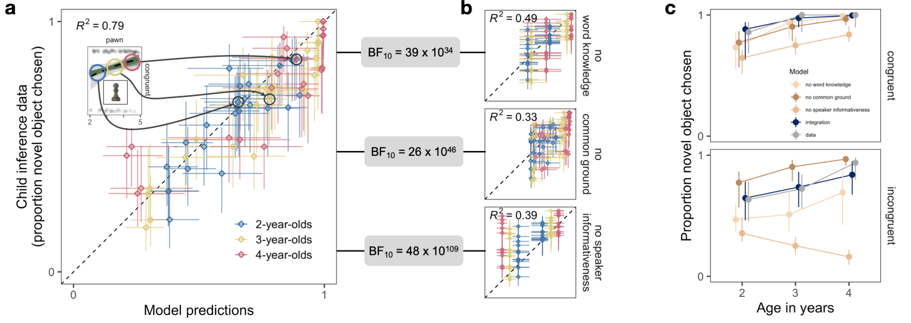

```{r setup, include = FALSE}
library("papaja")
```

```{r analysis-preferences}
# Seed for random number generation
set.seed(42)
knitr::opts_chunk$set(cache.extra = knitr::rand_seed)
```

Humans rely on language for communication, making language acquisition a key learning objective of early childhood [@tomasello2018natural]. A central problem in language learning is referent identification: To learn the conventional symbolic relation between a word and an object, the child has to determine the intended referent of the word. Referents can only be identified in an inferential manner by reasoning about the speaker’s intentions [@bohn2019pervasive]. That is, the child has to infer what the speaker is communicating about based on information sources in the social context of the utterance.

From early on in development, children use a number of different mechanisms to harness such social-contextual information sources [@bohn2019pervasive; @clark2009first; @bloom2002children].

expand (more stuff on ME - talk about interplay of word knowledge and inference)
For example, children expect speakers to use novel words for unknown objects [@markman1988children], (use pre-existing word knowledge and combine this with inferential process by which the novel word is assumed to go with the novel object footnote(the nature of this inference is debated, we focus on one version)). Extensively studied, early developing

expand (more about informativeness etc?)
to talk about objects that are relevant [@frank2014inferring; @schulze20133], 

(mention common ground, cite and talk about more)
new in context [@akhtar1996role], or related to the ongoing conversation [@sullivan2016discourse;@horowitz2015young] cite the other gang. Mention preference and somehow weave in the other gang + computational models. 

These mechanisms, however, have largely been investigated in isolation. The picture of the learning process that emerges is that of a “bag of tricks”: mechanisms that operate (and develop) independently from one another [@bloom2002children]. Yet in natural social interaction, many sources of information are present [@bergelson2017nature;@frank2013social]. -- childs needs to integrate the different inforamtion sources. talk about braodly speaking pragmatic theories of language development that solve this problem: grice, sperber tomasello: social inference based on multiple inforamtion sources. the actual process of inforamtion integration is, however, described only in vague terms -- As a consequence, we have no explicit and quantitative theory of how the different word learning mechanisms can be integrated. Quantitative framework allows directly testing and comparing different hypothesis, a feature we use later on. 

intorduce previous work (including modelling work) looking at inforamtion integration: Mostly lingusitc with pragmatic infotmation - however, no manipulation of lingusitc ususally.

More generally talk about quantitative models of child developmetn (review paper   gopnik and bonawitz, Sophie) and their usefulness in theory building.

We present a theory of this integration process. Information sources serve different functional roles, all part of an integrated social inference process [@sperber2001relevance; @grice1991studies; @shafto2012learning]. Children use all available information to make inferences about the intentions behind a speaker’s utterance, which then leads them to correctly identify referents in the world and learn conventional word–object mappings. 
-- mention that this is an old idea, but that the theories were vague with respect to the intergration process -- 

We formalize this process and how it develops in a computational cognitive model [@frank2012predicting; @goodman2016pragmatic; @oberauer2019addressing], allowing us to quantify how well this theory predicts children’s actual learning in complex situations as well as to compare it directly to alternative theories. We consider theoretical competitors according to which children either ignore some information sources or process them in isolation. 

To empirically test the predictive and explanatory power of the model, we focus on three information sources that operate on different timescales: (1) expectations that speakers communicate in a cooperative and informative manner [@frank2014inferring; @clark1987principle], (2) shared common ground about what is being talked about in conversation [@bohn2018common; @clark1996using], and (3) semantic knowledge about previously learned word–object mappings [@fenson1994variability; @bloom2002children]. While (1) is a momentary expectation about a particular utterance, (2) grows over the course of a conversation, and (3) is learned across development. This interplay of timescales has been hypothesized to be an important component of word meaning inference [@frank2009using; @mcmurray2012word]. We jointly manipulated these information sources and tested how well different theories predicted children’s behavior.

-- say what we did, first look at predictive pwoer of the model and whether children use all the available information. Then look at the intergration proceess itself and use models to decide between different processes by which information could be integrated. --

```{r fig1, include = T, fig.align = "center", fig.cap = "Experimental task and model. (A and B) Screenshots from the experimental task. (i) The speaker encounters one object and then leaves the scene (ii). While the speaker is away, a second object appears (iii), when returning, the speaker uses a novel word to request an object (iv). Sections (i) to (iii) establish common ground between the speaker and the listener, in that one object is new in context (green). The request in (iv) licenses an inference based on expectations about how informative speakers are (red). Listeners' semantic knowledge enters the task because the identity of the  known object on one of the tables is varied from well-known objects like a duck to relatively unfamiliar objects like a chess pawn (total of 12 objects - blue). (A) shows the condition in which common ground information is congruent (i.e. point to the same object) with speaker informativeness and (B) shows the incongruent condition. The congruent and incongruent conditions are each paired with the 12 known objects, resulting in 24 unique conditions. (C to E) show developmental trajectories for each information source, estimated from separate experiments (see supplement). (F) gives the model equation for the rational integration model and links information sources to model parameters.", out.width="100%"}

```
To test the model, we constructed a word learning paradigm (Fig. 1) in which children interacted on a table computer with a series of storybook speakers [@frank2016using]. The speakers used novel words (e.g., wug) in the context of two potential referents. This situation is depicted in Fig. 1A-iv, in which a speaker (here, a frog) appears with a known object (a duck, left) and an unfamiliar object (the diamond-shaped object, right). To identify the referent, the child could rely upon the three information sources described above. First, they may infer that a cooperative speaker would have used the word duck to refer to the known object (the duck); the fact that the speaker did not say duck then suggests that the speaker is most likely referring to a different object (the unfamiliar object). Thus, the listener can infer the referent of the novel word by assuming that the speaker is a rational agent who chooses the most informative words to refer to objects [@frank2014inferring]. Second, the child may rely upon what has already been established in the common ground with the speaker. Listeners expect speakers to communicate about things that are new to the common ground [@akhtar1996role]. Thus, the inference about the novel word referring to the unfamiliar object also depends on which object is new in context (Fig. 1A and B i-iii). Finally, the child may rely upon their previously acquired semantic knowledge, that is, how sure they are that the known object is called duck. If the known object is something less familiar, such as a chess piece (e.g., a pawn), a 3-year-old child may draw a weaker inference, if they draw any inference at all [@lewis2020-me]. Taken together, the child has the opportunity to integrate their assumptions about (1) informative communication, (2) their understanding of the common ground, and (3) their existing semantic knowledge. In some versions of the experiment, these information sources were aligned (Fig. 1A) but in some they were in conflict (Fig. 1B). 

Our rational integration model arbitrates between information sources via Bayesian inference (Fig. 1F). A listener (L1) reasons about the referent of a speaker's (S1) utterance. This reasoning is contextualized by the prior probability of each referent $\rho$ which we take to be a function of the common ground shared between the listener and the speaker. To decide between referents, the listener (L1) reasons about what a rational speaker (S1) with informativeness $\alpha$ would say given an intended referent. This speaker is assumed to compute the informativity for each available utterance and then choose the most informative one. The informativity of each utterance is given by imagining which referent a listener who interprets words according to their literal semantics (what we call a literal listener, L0), would infer upon hearing the utterance. Naturally, this reasoning depends on what kind of semantic knowledge (for object j) $\theta$~j~ the speaker ascribes to the (literal) listener. Taken together, this model provides a quantitative theory of information integration during language learning. Furthermore, the model presents an explicit and substantive theory of development. It assumes that, while children’s sensitivity to the individual information sources increases with age, the way integration proceeds remains constant [@bohn2019pervasive]. In the model, this is accomplished by making the parameters capturing sensitivity to speaker informativeness ($\alpha$~i~, Fig. 1D), the common ground ($\rho$i, Fig. 1C), and object specific semantic knowledge ($\theta$~i,j~, Fig. 1E) a function of the child’s age. 

# Results

## Predicting information integration accross development

We tested the model in its ability to predict children’s actual behavior - at an age (between 2 and 5 years) at which they learn language at an exponential rate [@bloom2002children]. We estimated children’s (N=148) developing sensitivity to individual information sources in separate experiments (see Fig. 1C-E). We then generated - and pre-registered [26] - parameter-free, quantitative, *a priori* model predictions (developmental trajectories) representing the model's expectations about how children should behave in a new situation in which all three information sources had to be integrated. We generated model predictions for 24 experimental conditions: 12 objects of different familiarities (requiring different levels of semantic knowledge), with novelty either conflicting or coinciding; Fig. 1. We compared these predictions to newly collected data from N = 220 children from the same age range. The results showed a very close alignment between model predictions and the data across the entire age range and explained 79% of the variance in the data (Figs. 2 and S6). 

Next, we formalized the alternative view that children selectively ignore information sources in the form of three lesioned models (Fig. 2). These models assume that children follow the heuristic “ignore X” (with X being one of the information sources) when multiple information sources are presented together.

The marginally less-complex *no word knowledge model* uses the same model architecture. It takes in expectations about speaker informativeness and common ground, but omits semantic knowledge that is specific to the familiar objects (i.e., uses only general semantic knowledge). The object specific parameters for semantic knowledge are fitted via a hierarchical regression (mixed effects) model. In this model, there is an overall developmental trajectory for semantic knowledge (main effect) and then there is object-specific variation around this trajectory (random effects). The *no word knowledge model* takes in the overall trajectory for semantic knowledge but ignores object-specific variation. That is, the model assumes a listener whose inference does not vary depending on the particular familiar object but only depends on the age specific average semantic knowledge.

We found little support taht children make inferences following one of the heuristic models. In fact, the data was several orders of magnitude more likely under the rational integration model compared to any of the lesioned models (Bayesian model comparison via marginal likelihood of the data, [@lee2014bayesian], Fig. 2). Thus, children considered all available information sources.

(ref:figlab2) **Predicting information integration**. Correlation between model predictions and child inference data for all 24 conditions and for each age group (binned by year) for the rational integration model and the three lesioned models. Horizontal and vertical error bars show 95% HDI. Inset shows an example of model predictions as developmental trajectories (see Fig. 3). The no word knowledge model includes developmental change for overall vocabulary development but ignores the identity of the known object. The no common ground model assumes that children ignore information from common ground and the no speaker informativeness model assumes that children ignore inferences that are licensed by expectations about informative communication. BF~10~ gives the Bayes Factor in favor of the integration model based on the marginal likelihood of the data under each model.

```{r fig2, include = T, fig.align = "center", fig.cap = "(ref:figlab2)", out.width="100%"}


```

## Explaining the process of information integration

The fact that children took into account all the available information sources may be surprising, but does not rule out the alternative view that the different information sources are processed independently from one another. It is equally plausible that children compute separate inferences based on a subset of the available information and then integrate them by weighting them, for example according to some ratio $\phi$. On this view, children would also consider all information sources, but they would be biased towards some of them. We formalized this alternative view as a biased integration model. 

The parameter $\phi$ in the biased integration model is unknown ahead of time and has to be estimated based on the experimental data. That is, in contrast to the rational integration model, the biased integration model does not allow to make *a priori* predictions about new data in the way we describe above. For the model comparison, we therefore constrained the parameters in the rational integration model by the experimental data as well. As a consequence, both models use all the information available to constrain their parameters.

Even though the biased integration model makes reasonable predictions, the rational integration model presents a much better fit to the data, both in terms of correlation and marginal likelihood of the data (Fig. 3). A final amendment of the biased integration view could be that children are in fact biased towards some information sources, but this bias changes with age. (In contrast, to the rational integration model which assumes that the integration process itself does not change with age [@bohn2019pervasive]). To decide between these two perspectives, we formalized a developmental bias model, which is structurally identical to the biased integration model but in which the parameter $\phi$ changes with age. When directly compared, the rational integration model again provided a much better explanation of the data and the underlying developmental process (Fig. 3). Interestingly, the rational integration model also outperformed both bias models when its parameters are not constrained by the experimental data (see supplement).

(ref:figlab3) **Explaining information integration across development**. (A) Model predictions from the rational integration model (colored lines) next to the behavioral data (dotted black lines with 95% CI in gray) for all 24 experimental conditions. Top row (blue) shows conditions in which common ground information is congruent with speaker informativeness, bottom row (red) shows conditions in which they are incongruent. Known objects are ordered based on their rated age of acquisition (left to right). Light dots represent individual data points. (B) Correlations between model predictions binned by age and condition for the integration model and the two mixture models. Vertical and horizontal error bars show 95% HDIs. BF~10~ gives the Bayes Factor in favor of the rational integration model based on the marginal likelihood of the data under each model.

```{r fig3, include = T, fig.align = "center", fig.cap = "(ref:figlab3)", out.width="100%"}
knitr::include_graphics("./figures/figure3.png")
```

# Discussion

These findings show that young children can flexibly integrate multiple information sources during language learning, even from relatively early in development. To answer the question of how they do so, we presented a formal cognitive model that assumes that information sources are rationally integrated via Bayesian inference. This model accurately predicted children’s behavior between 2 and 5 years of age and provided a better explanation of the integration process and its development compared to a range of competitor models that either neglected or prioritized some information sources. 

Replicate with other languages and other cultural settings.

more explicit model of common ground (see perspective taking work mcc)
integrate process of word learning itself via cross-situational learning 

The model is derived from a more general framework for pragmatic inference, which has been used to explain a wide variety of phenomena in adults’ language use and comprehension [@monroe2017colors; @wang2016learning; @tessler2019language; @yoon_frank_tessler_goodman_2018]. Thus, it can be generalized in a natural way to capture word learning in contexts that offer more, fewer, or different types of information [e.g. @bohn_tessler_merrick_frank_2019]. The flexibility of the framework stems from its conceptualization of human communication as a form of rational social action.

Connections to naive utility caluclus stuff?

As such, this work adds to theories that see the onto- and phylogenetic emergence of language as deeply rooted in social cognition.

# Methods

## Particiapnts

## Materials

## Procedure

## Data analysis

\newpage

# References
```{r create_r-references}
r_refs(file = "r-references.bib")
```

\begingroup
\setlength{\parindent}{-0.5in}
\setlength{\leftskip}{0.5in}

<div id = "refs"></div>
\endgroup
